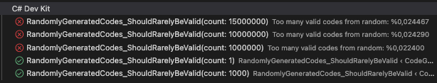

# CodeGenerator — Campaign Key Generator

## 📝 Problem

A food company plans to run a promotional campaign using 8-character unique codes printed inside product packages. Each code must:

- Be **exactly 8 characters** long
- Use only the characters from: `ACDEFGHKLMNPRTXYZ234579`
- Be **algorithmically verifiable without external storage**
- Be **difficult to guess or brute-force**

---

## 🔐 Key Structure & Bit Allocation

### 🔢 Code Space and Bit Calculation

The 8-character codes are derived from a custom 23-character alphabet: `ACDEFGHKLMNPRTXYZ234579`. This alphabet provides 23 possible values for each character in the code.

The total number of possible codes is calculated as:

```
23^8 = 78,310,985,281
```

This means there are over 78 billion unique combinations available. To determine the number of bits required to represent this space:

```
log₂(78,310,985,281) ≈ 36.2
```

Thus, each code effectively represents approximately 36 bits of information. This calculation ensures that the 8-character format is compact while still providing a large enough space for unique and secure codes.

Each 8-character code is a compact representation of a 36-bit structure, broken down as follows:

| Segment    | Bit Size | Purpose                                       |
|------------|----------|-----------------------------------------------|
| Seed       | 24 bits  | Unique identifier and core data of the code   |
| KeyByte    | 8 bits   | Derived via salted SHA-256 for validation     |
| Checksum   | 4 bits   | Ensures structural integrity, prevents tampering |

This structure strikes a balance between **security**, **uniqueness**, and **code length constraints** within an 8-character format.

---

### 🧩 Design Rationale

#### ✅ Seed — 24 bits
- Represents the core value of the key.
- Allows for exactly `2^24 = 16,777,216` unique combinations.
- Each key must start from a unique seed to ensure one-time generation.

#### ✅ KeyByte — 8 bits
- Calculated from a combination of the seed and a private key using a salted SHA-256 hash.
- It ensures that the key is tamper-proof and non-trivially derivable.
- Not random — it is deterministically derived from the seed.

#### ✅ Checksum — 4 bits
- Provides lightweight validation.
- Prevents accidental or brute-forced valid keys.
- Typically calculated with a modulo operation across seed and keyByte (e.g. sum % 16).

---
## 🔐 Brute-Force Collision Probability

[`Brute-Force-Collision`](./docs/collision.md) — Brute-Force Collision Probability




---
## 📚 References

- [Fisher-Yates Shuffle Randomization Algorithm – Atomic Spin](https://spin.atomicobject.com/fisher-yates-shuffle-randomization-algorithm/)
- [Implementing a Partial Serial Number Verification System in Delphi – Brandon Staggs](https://www.brandonstaggs.com/2007/07/26/implementing-a-partial-serial-number-verification-system-in-delphi/)
- [How to Generate License Keys – keygen.sh Blog](https://keygen.sh/blog/how-to-generate-license-keys/)

